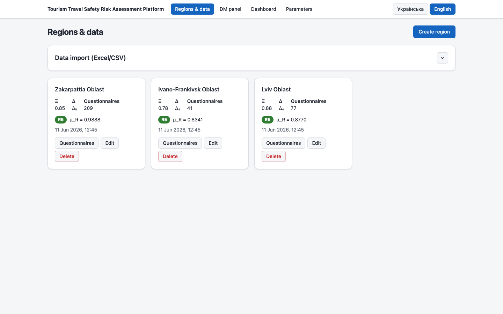
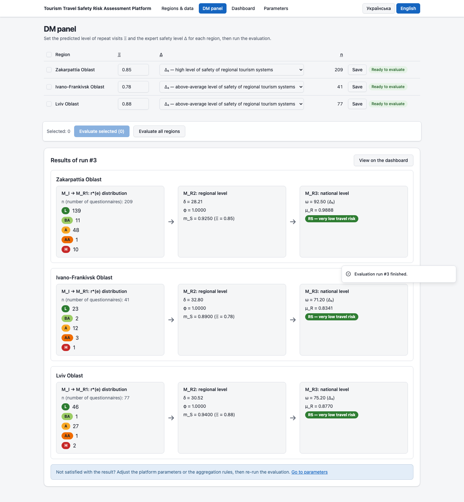
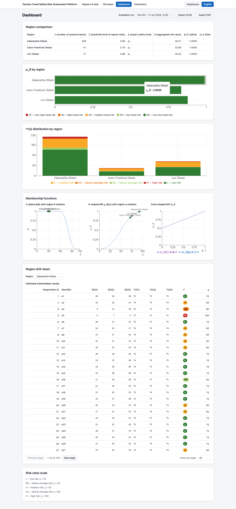
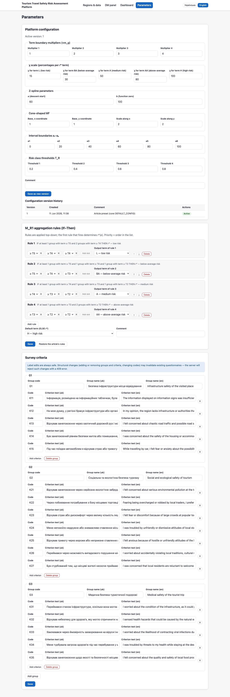

# User Manual

**Tourism Travel Safety Risk Assessment Platform**
(Intelligent Analytical Platform for Tourism Travel Safety Risk Assessment)

This manual is intended for the decision-maker (DM) and analysts working with the platform. Ukrainian version: [user-manual.uk.md](user-manual.uk.md).

---

## 1. Purpose of the Platform

The platform is a software implementation of the operator **T₅(R, E, Ξ, Δ, M_I, M_R1, M_R2, M_R3) → Y(f₅) = {μ_R, T_R}**: from questionnaire assessments by tourism participants (17 safety criteria in three groups — infrastructure, social and ecological, and medical safety — on a five-point linguistic scale from l₁ "completely disagree" to l₅ "completely agree"), the DM-entered predicted level of repeat visits to the region Ξ ∈ [0; 1], and the expert safety level of regional tourism systems Δ (terms Δ₁–Δ₅), the platform computes for every region a quantitative tourism travel safety risk assessment μ_R ∈ [0; 1] and its linguistic interpretation T_R — one of the classes from R₁ "very high risk" to R₅ "very low risk". The computation passes sequentially through four modules: M_I (information module — per-group rating sums θ_g), M_R1 (individual level — each respondent's risk term r*(e) derived by "If–Then" rules), M_R2 (regional level — the generalized value δ(R), the Z-spline φ(R), and a cone-shaped membership function that combines φ with Ξ into the feeling-of-safety level m_S(R)), and M_R3 (national level — fuzzification ω(R) using Δ and an S-shaped membership function yielding the final μ_R and T_R). Every intermediate result of every module is available for inspection, and every model constant is configurable.

## 2. System Requirements and Startup

### 2.1. Public demo (no installation)

A public demonstration instance is available at **<https://travel-risk-platform.andrii-shafar.workers.dev>**.

> **Note on data persistence:** the demo database is ephemeral — it resets after the instance has been idle for ~30 minutes, after every new deployment, and during host maintenance. If the data disappears, simply click **"Load demo dataset"** on the **Regions & data** page again. For persistent data, run the platform yourself with Docker (section 2.2).

### 2.2. Running with Docker (recommended for persistent data)

Requires Docker with Compose. From the repository root run:

```sh
docker compose up -d --build
```

Open **http://localhost:8080** in a browser. The SQLite database persists in the named volume `api-data` across restarts. To stop the platform and **delete all data**:

```sh
docker compose down -v
```

### 2.3. Running in development mode

Requires [uv](https://docs.astral.sh/uv/) (manages Python itself) and Node.js ≥ 20. In two terminals from the repository root:

```sh
# Terminal 1 — API on port 8000 (SQLite at ./data/app.db)
uv run --project backend uvicorn app.main:app --reload --port 8000

# Terminal 2 — web UI on port 5173 (proxies /api to :8000)
cd frontend && npm install && npm run dev
```

Open **http://localhost:5173**.

### 2.4. First steps

1. On the **Regions & data** page click **"Load demo dataset"** — this imports the demonstration set of 327 questionnaires across three oblasts (Zakarpattia, Ivano-Frankivsk, Lviv) with Ξ and Δ values already set.
2. Go to the **DM panel** and click **"Evaluate all regions"**.
3. Inspect the results on the **Dashboard**.

## 3. Interface Overview

The header of every page contains the platform title, navigation between the four pages, and the interface language switcher (**Українська / English**; the choice is remembered by the browser).

### 3.1. Regions & data



The page for managing input data: the **"Data import (Excel/CSV)"** block (file picker, target region, "Import" and "Load demo dataset" buttons) and the region cards. Each card shows the region name, the current Ξ and Δ, the questionnaire count, the latest evaluation result (color-coded risk class and μ_R with its date), and the **Questionnaires**, **Edit**, and **Delete** buttons. The **"Create region"** button is in the top-right corner.

### 3.2. DM panel



The decision-maker's workspace: a table of regions with Ξ input fields, Δ selectors, questionnaire counts n, and readiness indicators; evaluation launch buttons ("Evaluate selected", "Evaluate all regions"). Below — the results of the latest run with each module's intermediate results per region and a "View on the dashboard" link. At the bottom — the decision-support loop callout with a "Go to parameters" link.

### 3.3. Dashboard



Region comparison for a selected evaluation run: a summary table, the μ_R bar chart with the color-coded risk scale, the distribution of individual assessments r*(e), membership function plots (Z-spline and S-shaped MF) with region markers, the drill-down into individual intermediate results, and the **"Export XLSX"** / **"Export PDF"** buttons.

### 3.4. Parameters



Model configuration: the **"Platform configuration"** block (term boundary multipliers, the χ scale, Z-spline parameters, the cone-shaped MF, the boundaries a₁–a₆, the T_R thresholds) with versioning; the **"M_R1 aggregation rules (If–Then)"** editor; the **"Survey criteria"** editor (group and criterion labels in both languages).

## 4. Typical Workflow

### 4.1. Creating regions

On the Regions & data page click **"Create region"** and enter the name in Ukrainian and English. Ξ and Δ may be set immediately or later on the DM panel. The number of regions is unlimited. The "Edit" button on a card changes names and Ξ/Δ; "Delete" removes the region **together with all its questionnaires** (a confirmation is requested).

### 4.2. Importing questionnaires from Excel/CSV

In the "Data import (Excel/CSV)" block choose an `.xlsx` or `.csv` file (CSV must be UTF-8 encoded). The expected format follows the file «Експертне оцінювання.xlsx»:

| Column | Content |
|---|---|
| first column | respondent identifier |
| «Рік …» ("Year …") | survey year (free text, e.g. «2021 рік») |
| «Місяць …» ("Month …") | month (free text, e.g. «Липень») |
| «Відвідуваний район:» ("Visited rayon:") | rayon; **the oblast in parentheses** (used to determine the region) |
| «Тип розміщення:» ("Accommodation type:") | accommodation type (free text) |
| K1–K17 | ratings 1–5 per criterion; K1–K5 → group G₁, K6–K12 → G₂, K13–K17 → G₃ |

Extra columns are ignored. The **"Target region"** field: if a specific region is selected, all rows are imported into it; if left at "Detect from the «Visited rayon» column", rows are grouped by the oblast in parentheses, and missing regions are created automatically (their Ξ and Δ must then be set manually).

After the import a report is shown: the numbers of imported and skipped rows, the list of created regions, and a **"Row errors"** table (row number + message). Faulty rows (missing ratings, values outside 1–5) are skipped — the rest of the file is still imported. Limits: files up to 10 MiB, up to 10,000 data rows.

The **"Load demo dataset"** button imports the bundled set of 327 questionnaires and creates the three oblasts with the article's values: Zakarpattia (Ξ = 0.85, Δ₅), Ivano-Frankivsk (Ξ = 0.78, Δ₄), Lviv (Ξ = 0.88, Δ₄). The import is idempotent: clicking it again returns a 409 error (see section 5).

### 4.3. Adding and editing questionnaires manually

Click **"Questionnaires"** on a region card to open the questionnaire table with filters by year, month, and accommodation type, and paging. The **"Add questionnaire"** button opens a form: identifier, year, month, accommodation type (all optional) and 17 criterion ratings grouped by G₁–G₃ with the full criterion texts. Each rating is an integer from 1 (l₁ "completely disagree") to 5 (l₅ "completely agree"). Existing questionnaires can be edited and deleted.

### 4.4. Entering Ξ and Δ on the DM panel

On the DM panel set, for every region:

- **Ξ** — the predicted level of repeat visits to the region, a number from 0 to 1;
- **Δ** — the expert safety level of regional tourism systems, one of the terms Δ₁ (low) … Δ₅ (high).

Next to each region a status is shown: **"Ready to evaluate"** or a list of what is missing ("Ξ not set", "Δ not set", "no questionnaires").

### 4.5. Running an evaluation

Tick the desired regions and click **"Evaluate selected"**, or click **"Evaluate all regions"**. The evaluation uses the **active** configuration version and the active rule set; snapshots of both are stored with the result, so later parameter changes do not affect saved runs. Every region in a run must have Ξ, Δ, and at least one questionnaire — otherwise the platform returns an error listing the offending regions and reasons.

### 4.6. Reading the intermediate results per module

After a run the DM panel shows "Results of run #N" — three computation steps for each region:

1. **M_I → M_R1: r\*(e) distribution** — how many respondents received each individual risk term: L (low), BA (below average), A (average), AA (above average), H (high). For each respondent the ratings are summed per group (θ_g), converted to terms T₁–T₅, and aggregated by the "If–Then" rules.
2. **M_R2: regional level** — δ (the generalized risk value — the mean percentage value χ over all questionnaires), φ (the Z-spline value at δ), and m_S (the feeling-of-safety level — the cone-shaped MF applied to φ and Ξ).
3. **M_R3: national level** — ω (fuzzification: m_S multiplied by the interval boundary corresponding to the Δ term), μ_R (the quantitative risk assessment — the S-shaped MF value at ω), and T_R (the linguistic assessment, a color-coded class R₁–R₅).

Note: **a higher μ_R means a lower risk** (μ_R ≥ 0.8 → R₅ "very low tourism travel risk").

Per-respondent intermediates (each respondent's θ, terms, r*, χ) are available in the dashboard drill-down.

### 4.7. Dashboard: how to read each chart

At the top — the evaluation run selector (the latest run by default). The dashboard consists of:

- **"Region comparison"** — a table with all the run's values per region: n, Ξ, Δ, δ, φ, m_S, ω, μ_R, T_R.
- **"μ_R by region"** — a horizontal bar chart of μ_R; the bar color corresponds to the risk class. The risk color scale (used consistently across the interface):

  | Class | μ_R range | Interpretation | Color |
  |---|---|---|---|
  | R₁ | [0; 0.2) | very high risk | red |
  | R₂ | [0.2; 0.4) | high risk | orange |
  | R₃ | [0.4; 0.6) | medium risk | yellow |
  | R₄ | [0.6; 0.8) | low risk | light green |
  | R₅ | [0.8; 1] | very low risk | green |

- **"r\*(e) distribution by region"** — a stacked bar chart of the individual risk terms per region; colors run from green (L) to red (H). It reveals the answer structure behind each δ(R).
- **"Membership functions"** — two plots built from the active configuration: the **Z-spline φ(δ)** with markers at each region's actual δ (showing which part of the curve the region sits on), and the **S-shaped MF μ_R(ω)** with markers at the regions' ω values.
- **"Region drill-down"** — a region selector and a paged table of individual intermediate results: respondent identifier, θ(G₁)–θ(G₃), terms T(G₁)–T(G₃), r*, and χ.

### 4.8. Exporting results

The **"Export XLSX"** and **"Export PDF"** buttons on the dashboard download the selected run **in the current interface language** (switch the language in the header to obtain the report in the other language):

- **XLSX** — a summary sheet + one sheet per region with the individual intermediate results;
- **PDF** — a localized summary report: the region comparison table, the parameters used, and the T_R interpretations.

### 4.9. Configuring the model parameters

The Parameters page, **"Platform configuration"** block. What each parameter means:

- **Term boundary multipliers (×m_g)** — four numbers (default 1, 2, 3, 4) defining the thresholds at which θ_g maps to the terms T₁–T₅ as multiples of the group size m_g: T₁ for θ_g < 1·m_g, T₂ for 1·m_g ≤ θ_g < 2·m_g, …, T₅ for θ_g ≥ 4·m_g.
- **The χ scale** — the percentage value for each individual risk term r* (default L → 15, BA → 30, A → 50, AA → 80, H → 100); the mean χ over a region's questionnaires gives δ(R).
- **Z-spline parameters** — **a** (default 60): up to this δ the function φ = 1 (a full "feeling of safety"); **b** (default 100): from this value φ = 0. Between a and b, φ decreases smoothly as a quadratic spline.
- **Cone-shaped MF** — the base coordinates (default (1; 1)) and scales (default (2; 2)) of the cone that combines φ and Ξ into m_S.
- **Interval boundaries a₁–a₆** — default 0, 20, 40, 60, 80, 100; the term Δ_k maps to the multiplier a_{k+1} during fuzzification: ω = a_{k+1} · m_S (Δ₁ → 20, …, Δ₅ → 100). The same a₁ and a₆ define the domain of the S-shaped MF.
- **Risk class thresholds T_R** — four thresholds (default 0.2, 0.4, 0.6, 0.8) dividing the μ_R range into the classes R₁–R₅.

Changes are saved with **"Save as new version"** (with an optional comment) — the configuration is versioned, and any previous version can be activated from the "Configuration version history". Evaluations always use the active version.

### 4.10. The "If–Then" rule editor (M_R1 aggregation)

The **"M_R1 aggregation rules (If–Then)"** block defines how the three criteria groups' terms are folded into the individual assessment r*(e). How the rules work:

- **Priority is top-down:** rules are checked in list order; the first rule that fires determines r*(e). The order is changed with the move buttons.
- **"At least" semantics:** each rule is a set of slots with minimum term levels. A rule fires if the respondent's group terms can be assigned to the slots so that each group's term is **at least** its slot level (each group occupies at most one slot). For example: "IF at least 1 group with term ≥ T₅ and 2 groups with term ≥ T₄ — THEN r* = L".
- **The default rule:** if no rule fires, the "Default term (ELSE r*)" is assigned — H (high risk) by default, a conservative assessment.

The article's default preset: [T₅,T₄,T₄] → L; [T₅,T₄,T₃] → BA; [T₄,T₃,T₂] → A; [T₃,T₂,T₂] → AA; else → H. Rule sets are versioned just like the configuration; the **"Restore the article's rules"** button creates a new active version with the default preset.

In the **"Survey criteria"** block the group labels and criterion texts can be edited in both languages. Structural changes (adding/removing criteria, changing codes) are allowed only while no questionnaires would be invalidated by them — otherwise the server rejects the save with a 409 error.

### 4.11. The decision-support loop

If an evaluation result does not satisfy the DM, follow the callout at the bottom of the DM panel ("Not satisfied with the result? Adjust the platform parameters or the aggregation rules, then re-run the evaluation"):

1. go to Parameters and adjust the configuration and/or the rules (a new version is saved);
2. refine Ξ/Δ on the DM panel if needed;
3. run the evaluation again.

Every run is kept in the history together with a snapshot of its parameters, so results obtained under different configurations can be compared by switching runs on the dashboard. The loop repeats until the DM obtains a justified assessment.

## 5. FAQ and Troubleshooting

**The "Load demo dataset" button returns an error (409 / "Demo dataset already loaded").**
The demo import is idempotent: it refuses to run if any of the article's three regions already contains questionnaires. This protects against data duplication. To re-import the demo dataset, delete the corresponding regions on the Regions & data page (or reset the database entirely: `docker compose down -v && docker compose up -d`) and repeat the import.

**The evaluation will not start: "Evaluation is not possible…".**
A region is ready only when Ξ and Δ are set and at least one questionnaire exists. Check the indicators in the DM panel table — "Ξ not set", "Δ not set", "no questionnaires" — and fix the cause (Ξ/Δ are entered right there on the panel; questionnaires via import or manually on Regions & data).

**How do I restore the default aggregation rules?**
On the Parameters page, in the rules block, click **"Restore the article's rules"** — a new version with the default rule set is created and activated. Previous versions remain in the history.

**How do I return to previous parameters?**
In the "Configuration version history" click "Activate" next to the desired version. Nothing needs to be deleted — versions are immutable.

**Why did an old run's results not change after I changed the parameters?**
This is by design: every run stores a snapshot of the configuration and the rules at execution time. To see the effect of new parameters, run the evaluation again.

**The server rejects a criteria edit with a 409 error.**
The structural change (removing a criterion, changing a code) would invalidate existing questionnaires. Either limit yourself to label edits, or first delete the questionnaires/regions that block the change.
