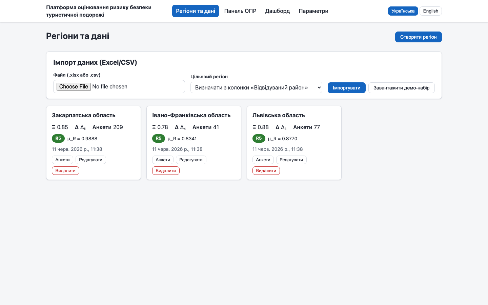
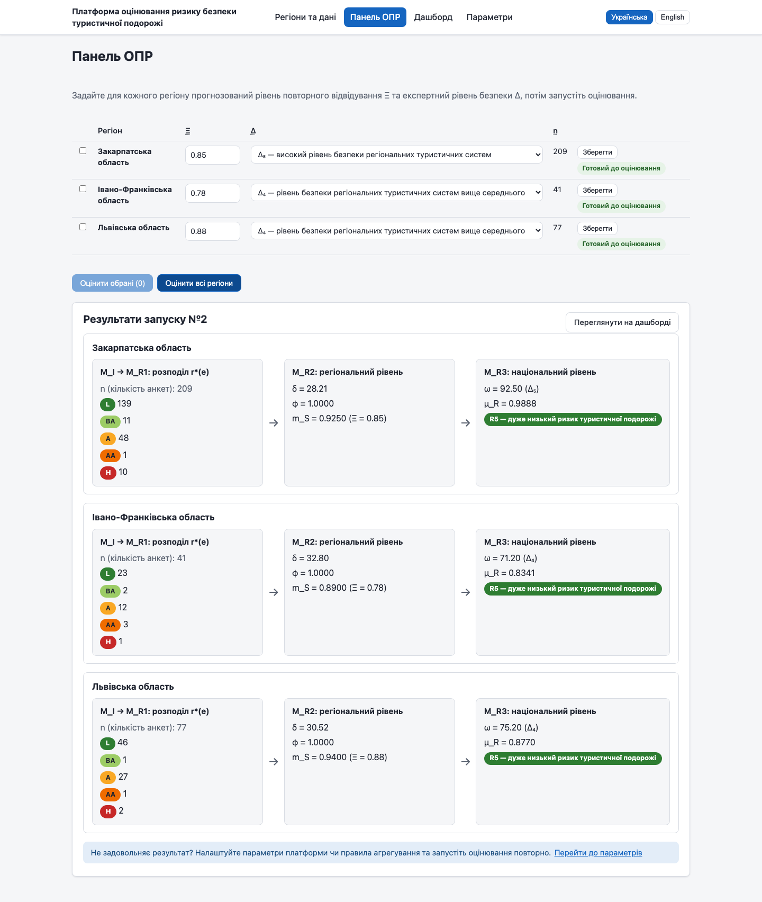
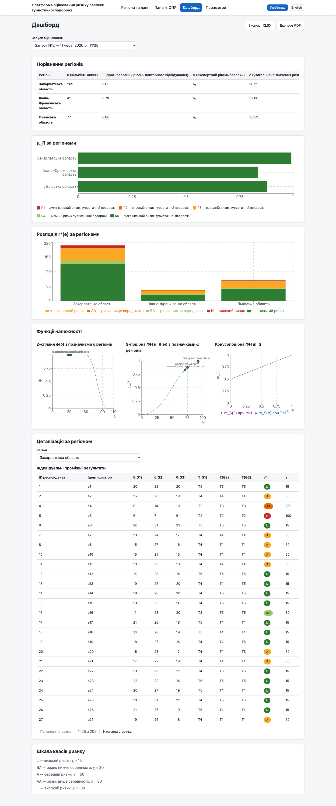
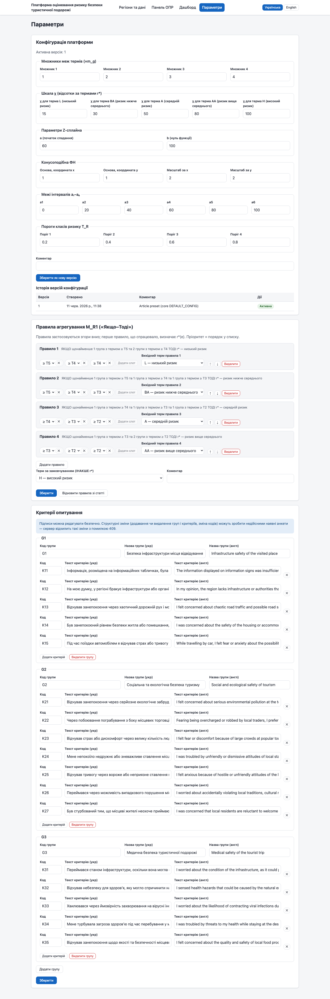

# Посібник користувача

**Платформа оцінювання ризику безпеки туристичної подорожі**
(Інтелектуальна аналітична платформа оцінювання ризику безпеки туристичної подорожі)

Посібник призначений для особи, що приймає рішення (ОПР), та аналітиків, які працюють з платформою. Англомовна версія: [user-manual.en.md](user-manual.en.md).

---

## 1. Призначення платформи

Платформа є програмною реалізацією оператора **T₅(R, E, Ξ, Δ, M_I, M_R1, M_R2, M_R3) → Y(f₅) = {μ_R, T_R}**: за анкетними оцінками учасників туристичної діяльності (17 критеріїв безпеки у трьох групах — інфраструктурна, соціально-екологічна та медична безпека — за п'ятибальною лінгвістичною шкалою від l₁ «Зовсім не погоджуюсь» до l₅ «Цілком погоджуюсь»), заданим ОПР прогнозованим рівнем повторних відвідувань регіону Ξ ∈ [0; 1] та експертним рівнем безпеки регіональних туристичних систем Δ (терми Δ₁–Δ₅) платформа обчислює для кожного регіону кількісну оцінку ризику безпеки туристичної подорожі μ_R ∈ [0; 1] та її лінгвістичну інтерпретацію T_R — один із класів від R₁ «дуже високий ризик» до R₅ «дуже низький ризик». Обчислення проходить послідовно через чотири модулі: M_I (інформаційний — суми балів θ_g за групами критеріїв), M_R1 (індивідуальний рівень — терм-оцінка ризику r*(e) кожного респондента за правилами «Якщо–Тоді»), M_R2 (регіональний рівень — узагальнене значення δ(R), Z-сплайн φ(R) та конусоподібна функція належності, що разом із Ξ дає рівень почуття безпеки m_S(R)) і M_R3 (національний рівень — фазифікація ω(R) з урахуванням Δ та S-подібна функція належності, що дає підсумкові μ_R і T_R). Усі проміжні результати кожного модуля доступні для перегляду, а всі константи моделі — для налаштування.

## 2. Системні вимоги та запуск

### 2.1. Запуск через Docker (рекомендовано)

Потрібен Docker із Compose. З кореневого каталогу проєкту виконайте:

```sh
docker compose up -d --build
```

Відкрийте у браузері **http://localhost:8080**. База даних SQLite зберігається в іменованому томі `api-data` і переживає перезапуски. Щоб зупинити платформу та **видалити всі дані**:

```sh
docker compose down -v
```

### 2.2. Запуск у режимі розробки

Потрібні [uv](https://docs.astral.sh/uv/) (сам керує версією Python) та Node.js ≥ 20. У двох терміналах з кореневого каталогу:

```sh
# Термінал 1 — API на порту 8000 (SQLite у ./data/app.db)
uv run --project backend uvicorn app.main:app --reload --port 8000

# Термінал 2 — вебінтерфейс на порту 5173 (проксіює /api на :8000)
cd frontend && npm install && npm run dev
```

Відкрийте **http://localhost:5173**.

### 2.3. Перші кроки

1. На сторінці **«Регіони та дані»** натисніть **«Завантажити демо-набір»** — буде імпортовано демонстраційний набір із 327 анкет по трьох областях (Закарпатська, Івано-Франківська, Львівська) з уже заданими значеннями Ξ і Δ.
2. Перейдіть на **«Панель ОПР»** і натисніть **«Оцінити всі регіони»**.
3. Перегляньте результати на **«Дашборді»**.

## 3. Огляд інтерфейсу

У шапці кожної сторінки розташовані назва платформи, навігація між чотирма сторінками та перемикач мови інтерфейсу (**Українська / English**; вибір зберігається в браузері).

### 3.1. Регіони та дані



Сторінка для керування вхідними даними: блок **«Імпорт даних (Excel/CSV)»** (вибір файлу, цільовий регіон, кнопки «Імпортувати» та «Завантажити демо-набір») і картки регіонів. На кожній картці — назва регіону, поточні Ξ і Δ, кількість анкет, результат останнього оцінювання (кольоровий клас ризику та μ_R із датою) і кнопки **«Анкети»**, **«Редагувати»**, **«Видалити»**. Кнопка **«Створити регіон»** — у правому верхньому куті.

### 3.2. Панель ОПР



Робоче місце ОПР: таблиця регіонів із полями введення Ξ, вибором Δ, кількістю анкет n та індикаторами готовності; кнопки запуску оцінювання («Оцінити обрані», «Оцінити всі регіони»). Нижче — результати останнього запуску з проміжними результатами кожного модуля по кожному регіону та посилання «Переглянути на дашборді». Внизу — блок циклу підтримки прийняття рішень із посиланням «Перейти до параметрів».

### 3.3. Дашборд



Порівняння регіонів за обраним запуском оцінювання: зведена таблиця, стовпчикова діаграма μ_R із кольоровою шкалою класів ризику, розподіл індивідуальних оцінок r*(e), графіки функцій належності (Z-сплайн і S-подібна ФН) з позначками регіонів, деталізація індивідуальних проміжних результатів та кнопки експорту **«Експорт XLSX»** / **«Експорт PDF»**.

### 3.4. Параметри



Налаштування моделі: **«Конфігурація платформи»** (множники меж термів, шкала χ, параметри Z-сплайна, конусоподібна ФН, межі a₁–a₆, пороги T_R) з версіонуванням; редактор **«Правила агрегування M_R1 («Якщо–Тоді»)»**; редактор **«Критерії опитування»** (підписи груп і критеріїв двома мовами).

## 4. Типовий робочий процес

### 4.1. Створення регіонів

На сторінці «Регіони та дані» натисніть **«Створити регіон»**, введіть назву українською та англійською. Значення Ξ і Δ можна задати одразу або пізніше на панелі ОПР. Кількість регіонів не обмежена. Кнопка «Редагувати» на картці дозволяє змінити назви та Ξ/Δ; «Видалити» — вилучає регіон **разом з усіма його анкетами** (запитується підтвердження).

### 4.2. Імпорт анкет з Excel/CSV

У блоці «Імпорт даних (Excel/CSV)» оберіть файл `.xlsx` або `.csv` (CSV — у кодуванні UTF-8). Очікуваний формат — як у файлі «Експертне оцінювання.xlsx»:

| Колонка | Вміст |
|---|---|
| перша колонка | ідентифікатор респондента |
| «Рік …» | рік опитування (вільний текст, напр. «2021 рік») |
| «Місяць …» | місяць (вільний текст, напр. «Липень») |
| «Відвідуваний район:» | район; **область — у дужках** (за нею визначається регіон) |
| «Тип розміщення:» | тип розміщення (вільний текст) |
| K1–K17 | оцінки 1–5 за критеріями; K1–K5 → група G₁, K6–K12 → G₂, K13–K17 → G₃ |

Зайві колонки ігноруються. Поле **«Цільовий регіон»**: якщо обрано конкретний регіон — усі рядки імпортуються в нього; якщо залишено «Визначати з колонки «Відвідуваний район»» — рядки розподіляються за областю з дужок, а відсутні регіони створюються автоматично (Ξ і Δ для них потрібно задати вручну).

Після імпорту виводиться звіт: кількість імпортованих і пропущених рядків, перелік створених регіонів і таблиця **«Помилки в рядках»** (номер рядка + повідомлення). Помилкові рядки (відсутні оцінки, значення поза діапазоном 1–5) пропускаються — імпорт решти файлу не переривається. Обмеження: файл до 10 МіБ, до 10 000 рядків даних.

Кнопка **«Завантажити демо-набір»** імпортує вбудований набір із 327 анкет і створює три області зі значеннями зі статті: Закарпатська (Ξ = 0.85, Δ₅), Івано-Франківська (Ξ = 0.78, Δ₄), Львівська (Ξ = 0.88, Δ₄). Імпорт ідемпотентний: повторне натискання повертає помилку 409 (див. розділ 5).

### 4.3. Ручне додавання та редагування анкет

Натисніть **«Анкети»** на картці регіону — відкриється таблиця анкет із фільтрами за роком, місяцем і типом розміщення та посторінковим переглядом. Кнопка **«Додати анкету»** відкриває форму: ідентифікатор, рік, місяць, тип розміщення (необов'язкові) та 17 оцінок за критеріями, згрупованих за G₁–G₃, з повними текстами критеріїв. Кожна оцінка — ціле число від 1 (l₁ «Зовсім не погоджуюсь») до 5 (l₅ «Цілком погоджуюсь»). Наявні анкети можна редагувати та видаляти.

### 4.4. Введення Ξ і Δ на панелі ОПР

На сторінці «Панель ОПР» для кожного регіону задайте:

- **Ξ** — прогнозований рівень повторного відвідування регіону, число від 0 до 1;
- **Δ** — експертний рівень безпеки регіональних туристичних систем, один із термів Δ₁ (низький) … Δ₅ (високий).

Поруч із кожним регіоном відображається статус: **«Готовий до оцінювання»** або перелік того, чого бракує («не задано Ξ», «не задано Δ», «немає анкет»).

### 4.5. Запуск оцінювання

Позначте потрібні регіони та натисніть **«Оцінити обрані»**, або натисніть **«Оцінити всі регіони»**. Оцінювання використовує **активну** версію конфігурації та активний набір правил; їх знімки зберігаються разом із результатом, тому подальші зміни параметрів не впливають на збережені запуски. Усі регіони запуску повинні мати задані Ξ, Δ і принаймні одну анкету — інакше платформа поверне помилку з переліком регіонів та причин.

### 4.6. Читання проміжних результатів за модулями

Після запуску панель ОПР показує «Результати запуску №N» — по кожному регіону три кроки обчислення:

1. **M_I → M_R1: розподіл r\*(e)** — скільки респондентів отримали кожну індивідуальну терм-оцінку ризику: L (низький), BA (нижче середнього), A (середній), AA (вище середнього), H (високий). Для кожного респондента його оцінки підсумовано за групами (θ_g), переведено в терми T₁–T₅ та агреговано правилами «Якщо–Тоді».
2. **M_R2: регіональний рівень** — δ (узагальнене значення ризику — середнє відсоткове значення χ за всіма анкетами), φ (значення Z-сплайна від δ) та m_S (рівень почуття безпеки — результат конусоподібної ФН від φ та Ξ).
3. **M_R3: національний рівень** — ω (фазифікація: m_S, помножене на межу інтервалу, що відповідає терму Δ), μ_R (кількісна оцінка ризику — значення S-подібної ФН від ω) та T_R (лінгвістична оцінка, кольоровий клас R₁–R₅).

Зверніть увагу: **більше значення μ_R означає нижчий ризик** (μ_R ≥ 0.8 → R₅ «дуже низький ризик туристичної подорожі»).

Поіндивідуальні проміжні результати (θ, терми, r*, χ кожного респондента) доступні в деталізації на дашборді.

### 4.7. Дашборд: як читати графіки

Угорі — вибір запуску оцінювання (за замовчуванням останній). Складові дашборда:

- **«Порівняння регіонів»** — таблиця з усіма величинами запуску по кожному регіону: n, Ξ, Δ, δ, φ, m_S, ω, μ_R, T_R.
- **«μ_R за регіонами»** — горизонтальна стовпчикова діаграма μ_R; колір стовпчика відповідає класу ризику. Кольорова шкала класів (використовується скрізь в інтерфейсі):

  | Клас | Значення μ_R | Інтерпретація | Колір |
  |---|---|---|---|
  | R₁ | [0; 0.2) | дуже високий ризик | червоний |
  | R₂ | [0.2; 0.4) | високий ризик | помаранчевий |
  | R₃ | [0.4; 0.6) | середній ризик | жовтий |
  | R₄ | [0.6; 0.8) | низький ризик | світло-зелений |
  | R₅ | [0.8; 1] | дуже низький ризик | зелений |

- **«Розподіл r\*(e) за регіонами»** — складена стовпчикова діаграма індивідуальних терм-оцінок по регіонах; кольори від зеленого (L) до червоного (H). Дозволяє побачити структуру відповідей, що стоїть за δ(R).
- **«Функції належності»** — два графіки, побудовані за активною конфігурацією: **Z-сплайн φ(δ)** із позначками фактичних δ кожного регіону (видно, на якій ділянці кривої перебуває регіон) та **S-подібна ФН μ_R(ω)** з позначками ω регіонів.
- **«Деталізація за регіоном»** — вибір регіону та посторінкова таблиця індивідуальних проміжних результатів: ідентифікатор респондента, θ(G₁)–θ(G₃), терми T(G₁)–T(G₃), r* і χ.

### 4.8. Експорт результатів

Кнопки **«Експорт XLSX»** і **«Експорт PDF»** на дашборді вивантажують обраний запуск **мовою поточного інтерфейсу** (перемкніть мову в шапці, щоб отримати звіт іншою мовою):

- **XLSX** — зведений аркуш + окремий аркуш по кожному регіону з індивідуальними проміжними результатами;
- **PDF** — локалізований підсумковий звіт: таблиця порівняння регіонів, використані параметри, інтерпретації T_R.

### 4.9. Налаштування параметрів моделі

Сторінка «Параметри», блок **«Конфігурація платформи»**. Значення кожного параметра:

- **Множники меж термів (×m_g)** — чотири числа (типово 1, 2, 3, 4), що задають межі переходу θ_g у терми T₁–T₅ як кратні розміру групи m_g: T₁ при θ_g < 1·m_g, T₂ при 1·m_g ≤ θ_g < 2·m_g, …, T₅ при θ_g ≥ 4·m_g.
- **Шкала χ** — відсоткове значення для кожної індивідуальної терм-оцінки r* (типово L → 15, BA → 30, A → 50, AA → 80, H → 100); середнє χ за всіма анкетами регіону дає δ(R).
- **Параметри Z-сплайна** — **a** (типово 60): до цього значення δ функція φ = 1 (повне «відчуття безпеки»); **b** (типово 100): від цього значення φ = 0. Між a і b φ плавно спадає квадратичним сплайном.
- **Конусоподібна ФН** — координати основи (типово (1; 1)) та масштаби (типово (2; 2)) конуса, що поєднує φ та Ξ у m_S.
- **Межі інтервалів a₁–a₆** — типово 0, 20, 40, 60, 80, 100; терм Δ_k відображається в множник a_{k+1} при фазифікації: ω = a_{k+1} · m_S (Δ₁ → 20, …, Δ₅ → 100). Ці самі a₁ і a₆ задають область визначення S-подібної ФН.
- **Пороги класів ризику T_R** — чотири пороги (типово 0.2, 0.4, 0.6, 0.8), що ділять діапазон μ_R на класи R₁–R₅.

Зміни зберігаються кнопкою **«Зберегти як нову версію»** (з необов'язковим коментарем) — конфігурація версіонується, в «Історії версій конфігурації» можна активувати будь-яку попередню версію. Оцінювання завжди використовує активну версію.

### 4.10. Редактор правил «Якщо–Тоді» (агрегування M_R1)

Блок **«Правила агрегування M_R1 («Якщо–Тоді»)»** визначає, як терми трьох груп критеріїв згортаються в індивідуальну оцінку r*(e). Принципи роботи:

- **Пріоритет — згори вниз:** правила перевіряються в порядку списку; перше правило, що спрацювало, визначає r*(e). Порядок змінюється кнопками переміщення.
- **Семантика «не нижче»:** кожне правило — це набір слотів із мінімальними рівнями термів. Правило спрацьовує, якщо терми груп респондента можна розподілити по слотах так, щоб терм кожної групи був **не нижче** рівня свого слота (кожна група займає не більше одного слота). Наприклад, правило «ЯКЩО щонайменше 1 група з термом ≥ T₅ та 2 групи з термом ≥ T₄ — ТОДІ r* = L».
- **Правило за замовчуванням:** якщо жодне правило не спрацювало, призначається «Терм за замовчуванням (ІНАКШЕ r*)» — типово H (високий ризик), консервативна оцінка.

Стандартний набір зі статті: [T₅,T₄,T₄] → L; [T₅,T₄,T₃] → BA; [T₄,T₃,T₂] → A; [T₃,T₂,T₂] → AA; інакше → H. Набори правил версіонуються так само, як конфігурація; кнопка **«Відновити правила зі статті»** створює нову активну версію зі стандартним набором.

У блоці **«Критерії опитування»** можна редагувати підписи груп і тексти критеріїв обома мовами. Структурні зміни (додавання/видалення критеріїв, зміна кодів) допускаються лише доки немає анкет, які вони зробили б недійсними, — інакше сервер відхилить збереження з помилкою 409.

### 4.11. Цикл підтримки прийняття рішень

Якщо результат оцінювання не задовольняє ОПР, скористайтеся підказкою внизу панелі ОПР («Не задовольняє результат? Налаштуйте параметри платформи чи правила агрегування та запустіть оцінювання повторно»):

1. перейдіть на «Параметри», скоригуйте конфігурацію та/або правила (збережеться нова версія);
2. за потреби уточніть Ξ/Δ на панелі ОПР;
3. запустіть оцінювання повторно.

Кожен запуск зберігається в історії разом зі знімком параметрів, тому результати різних конфігурацій можна порівнювати між собою, перемикаючи запуски на дашборді. Цикл повторюється, доки ОПР не отримає обґрунтовану оцінку.

## 5. Часті питання та усунення проблем

**Кнопка «Завантажити демо-набір» повертає помилку (409 / «Демо-набір уже завантажено»).**
Демо-імпорт ідемпотентний: він відмовляється виконуватися, якщо хоча б один із трьох регіонів статті вже містить анкети. Це захист від дублювання даних. Щоб імпортувати демо-набір заново, видаліть відповідні регіони на сторінці «Регіони та дані» (або повністю скиньте базу: `docker compose down -v && docker compose up -d`) і повторіть імпорт.

**Оцінювання не запускається: «Оцінювання неможливе…».**
Регіон вважається готовим, лише якщо задані Ξ і Δ та є хоча б одна анкета. Подивіться на індикатори в таблиці панелі ОПР: «не задано Ξ», «не задано Δ», «немає анкет» — і усуньте причину (Ξ/Δ вводяться там само на панелі; анкети — імпортом чи вручну на «Регіонах та даних»).

**Як відновити стандартні правила агрегування?**
На сторінці «Параметри» у блоці правил натисніть **«Відновити правила зі статті»** — буде створено й активовано нову версію зі стандартним набором правил. Попередні версії залишаться в історії.

**Як повернутися до попередніх параметрів?**
В «Історії версій конфігурації» натисніть «Активувати» біля потрібної версії. Видаляти нічого не потрібно — версії незмінні.

**Чому в старому запуску результати не змінилися після зміни параметрів?**
Так і має бути: кожен запуск зберігає знімок конфігурації та правил на момент виконання. Щоб побачити ефект нових параметрів, запустіть оцінювання повторно.

**Сервер відхиляє редагування критеріїв з помилкою 409.**
Структурна зміна (видалення критерію, зміна коду) зробила б недійсними наявні анкети. Або обмежтеся редагуванням підписів, або спершу видаліть анкети/регіони, які блокують зміну.
